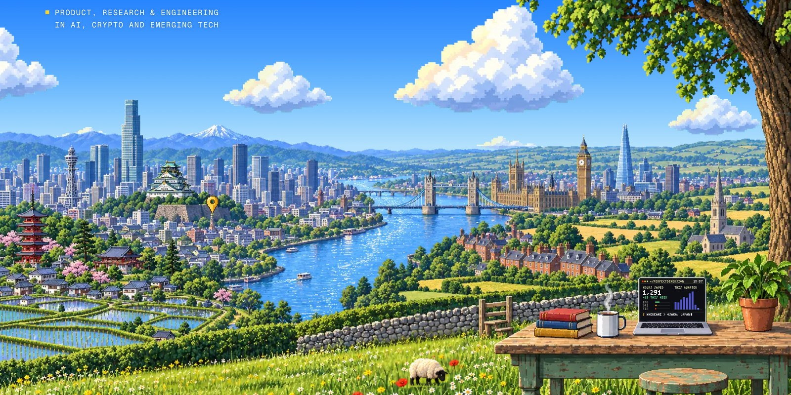

<picture>
  <source media="(prefers-color-scheme: dark)" srcset="assets/banner-night.jpg">
  
</picture>

<picture>
  <source media="(prefers-color-scheme: dark)" srcset="https://readme-typing-svg.demolab.com?font=Geist+Mono&size=20&pause=1500&color=FCD34D&vCenter=true&width=520&height=36&letterSpacing=0.1em&lines=APPLIED+AI+ENGINEERING;APPLIED+AI+PRODUCT;APPLIED+AI+RESEARCH">
  
</picture>

<samp>PAUL IS BUILDING <a href="https://www.perfectdimension.ai">PERFECT DIMENSION</a>. 
CURRENTLY IN OSAKA, JAPAN.</samp>

<samp>&nbsp; WORK</samp>

<samp><a href="https://www.perfectdimension.ai">PERFECT DIMENSION</a> &nbsp;APPLIED AI PRODUCT, ENGINEERING, RESEARCH & VENTURE 
<a href="https://hit.com">HIT</a> &nbsp;PREDICTION MARKETS, MARKET MAKING 
<a href="https://www.broadwaytechnology.com">BROADWAY TECHNOLOGY</a> &nbsp;FIXED INCOME TRADING SYSTEMS, ALGORITHMIC TRADING, DATA & ANALYTICS, UI/UX DESIGN 
<a href="https://www.smbcnikko.co.jp">SMBC NIKKO</a> &nbsp;FI MARKET MAKING, PROP TRADING, G5 GOVERNMENT BONDS, REPO & MONEY MARKETS 
<a href="https://www.mizuhogroup.com">MIZUHO</a> &nbsp;FI MARKET MAKING, PROP TRADING, SSA & CREDIT BONDS</samp>

<samp>&nbsp; AI TOOLS</samp>

  <picture><source media="(prefers-color-scheme: dark)" srcset="assets/stack/openai-dark.svg"></picture>&nbsp;&nbsp;
  <picture><source media="(prefers-color-scheme: dark)" srcset="assets/stack/anthropic-dark.svg"></picture>&nbsp;&nbsp;
  &nbsp;&nbsp;
  &nbsp;&nbsp;
  &nbsp;&nbsp;
  <picture><source media="(prefers-color-scheme: dark)" srcset="assets/stack/cursor-dark.svg"></picture>&nbsp;&nbsp;
  <picture><source media="(prefers-color-scheme: dark)" srcset="assets/stack/cognition-dark.svg"></picture>&nbsp;&nbsp;
  <picture><source media="(prefers-color-scheme: dark)" srcset="assets/stack/t3code-dark.svg"></picture>&nbsp;&nbsp;
  

<samp>&nbsp; LANGUAGES</samp>

  &nbsp;&nbsp;
  <picture><source media="(prefers-color-scheme: dark)" srcset="assets/stack/rust-dark.svg"></picture>&nbsp;&nbsp;
  &nbsp;&nbsp;
  <picture><source media="(prefers-color-scheme: dark)" srcset="assets/stack/solidity-dark.svg"></picture>&nbsp;&nbsp;
  &nbsp;&nbsp;
  

<samp>&nbsp; LINKS</samp>

<samp><picture><source media="(prefers-color-scheme: dark)" srcset="assets/links/website-dark.svg"></picture>&nbsp; <a href="https://www.pdito.com">PERSONAL WEBSITE</a></samp> 
<samp><picture><source media="(prefers-color-scheme: dark)" srcset="assets/links/company-dark.svg"></picture>&nbsp; <a href="https://www.perfectdimension.ai">COMPANY WEBSITE</a></samp> 
<samp><picture><source media="(prefers-color-scheme: dark)" srcset="assets/links/linkedin-dark.svg"></picture>&nbsp; <a href="https://www.linkedin.com/in/pwdavis/">LINKEDIN</a></samp> 
<samp><picture><source media="(prefers-color-scheme: dark)" srcset="assets/links/x-dark.svg"></picture>&nbsp; <a href="https://x.com/PDiTO">X</a></samp>
